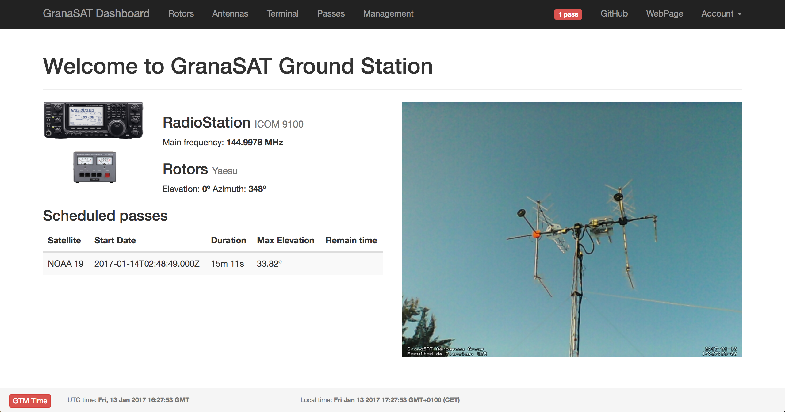
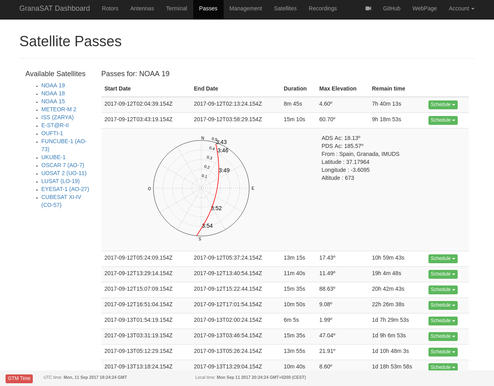

# GranaSAT Dashboard

GranaSAT Dashboard project aims to control our Ground Station via web, including:

- Antenna Rotors
- Kenwood TS-2000 radio transceiver
- ICOM 9100 radio transceiver
- TNC
- Sotfware Defined Radios

## Getting Started

These instructions will get you a copy of the project up and running on your local machine for development and testing purposes.

### Prerequisites

The project use NodeJs and npm dependencies. Some parts of the code use python (like scripts for update satellites database). To install them:
```
$ curl -sL https://deb.nodesource.com/setup_8.x | sudo -E bash -
$ sudo apt-get install -y nodejs
$ npm install -g bower
```

```
$ apt-get install build-essential
```

### Installing

First of all we have to install npm and bower dependencies:

```
$ npm install
$ bower install
``` 

Then we have to create config.json file. Copy confgisample.json into config.json:

```
$ cp configsample.json config.json
```

By default the proyect will use a mysql database, but you can change it to use a sqlite database that is in utils/test_database.db
Go to app.js and change the variable called db to:

```
$ var db = new require("./utils/test_database.js")();
```

And then you are able to run the Dashboard:
```
$ sudo node app.js
```

### Dashboard Main:



### Propagator:



## Authors

* **Pablo Garrido**  - *Initial work* - [Pablogs9](https://github.com/pablogs9)
* **Fran Acién** - *Collaborator* - [Acien101](https://github.com/acien101)
* **Alberto Marín** - *Database and Propagator* - [Albertomn86](https://github.com/albertomn86)

